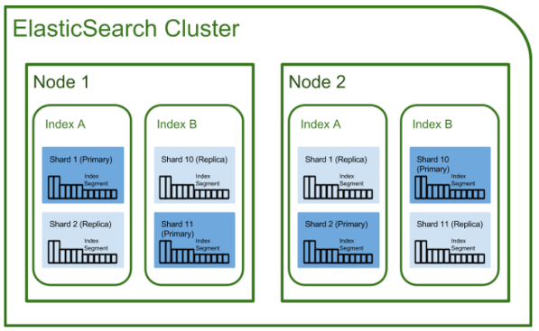

# ElasticStackStudy

## ELK구성요소(Elasticsearch, Logstash, Kibana)

### Elasticsearch (데이터베이스)
Logstash로부터 받은 데이터를 검색 및 집계를 하여 필요한 관심 있는 정보를 획득.   
Lucene 검색엔진 기반의 데이터베이스로 고성능의 검색 기능, 대규모 분산 시스템 기능 등을 제공한다.   
표준 RESTful API와 JSON을 이용해 데이터를 처리합니다.  

### Logstash (Input > filter > output 의 pipeline 구조로 수집하고 필터링하여 전달)
다양한 소스( DB, csv파일 등 )의 로그 또는 트랜잭션 데이터를 수집, 집계, 파싱하여 Elasticsearch로 전달   
데이터 수집 파이프라인 도구입니다.   
각 데이터베이스의 데이터, 로우 데이터, 윈도우 이벤트 등으로부터 데이터를 수집합니다.   
다양한 플러그인을 이용하여 데이터를 집계 및 보관, 서버 데이터 처리, 파이프라인으로 데이터를 수집하여 필터를 통해 변환 후 ElasticSearch로 전송합니다.    

### Kibana (시각화 담당)
Elasticsearch의 빠른 검색을 통해 데이터를 시각화 및 모니터링   
Elastic Search에 저장된 정보들을 검색 및 분석하고 시각화하는 기능을 갖고 있습니다.   

### Beats (데이터 전송 담당)
경량 에이전트로 설치되어 데이터를 Logstash 또는 ElasticSearch로 전송합니다.   
1) FileBeat   
- 서버에서 로그파일을 제공합니다.   
2) PacketBeat   
- 응용 프로그램 서버간에 교환되는 트랜잭션에 대한 정보를 제공하는 네트워크 패킷 분석기 입니다.   
3) MetricBeat   
- 운영 체제 및 서비스에서 Metrics를 주기적으로 수집하는 서버 모니터링 에이전트입니다.   
4) WinlogBeat   
- Windows 이벤트 로그를 제공합니다.   

## RDBMS와 Elasticsearch비교

## Elasticsearch 용어 정리
### 1) 클러스터( Cluster )
클러스터란 Elasticsearch에서 가장 큰 시스템 단위를 의미하며, 최소 하나 이상의 노드로 이루어진 노드들의 집합입니다.   
서로 다른 클러스터는 데이터의 접근, 교환을 할 수 없는 독립적인 시스템으로 유지되며,   
여러 대의 서버가 하나의 클러스터를 구성할 수 있고, 한 서버에 여러 개의 클러스터가 존재할수도 있습니다.   

### 2) 노드( Node )
Elasticsearch를 구성하는 하나의 단위 프로세스를 의미합니다.   
그 역할에 따라 Master-eligible, Data, Ingest, Tribe 노드로 구분할 수 있습니다.   
- 클러스터의 일부이며 데이터를 저장하고 클러스터의 인덱싱 및 검색 기능에 참여하는 단일 서버입니다.   
- 노드에 할당되는 임의 UUID인 이름으로 식별합니다.   
- 특정 클러스터를 클러스터 이름으로 결합하도록 노드를 구성 할 수 있습니다.   

### 3) 인덱스( Index ) / 샤드( Shard ) / 복제( Replica )
 index는 RDBMS에서 database와 대응하는 개념입니다.   
또한 shard와 replica는 Elasticsearch에만 존재하는 개념이 아니라, 분산 데이터베이스 시스템에도 존재하는 개념입니다.   

인덱스   
- 다소 유사한 특성을 갖는 문서들의 집합입니다.   
- 단일 클러스터에서 원하는만큼의 인덱스를 정의 할 수 있습니다.   

샤드   
- Index는 잠재적으로 단일 노드의 하드웨어 제한을 초과 할 수 있는 많은 양의 데이터를 저장 할 수 있습니다. 하지만 단일 노드의 디스크가 맞지 않거나 단일 노드의 검색 요청만 처리하기에는 너무 느릴 수 있기 때문에 shards를 이용하여 Index를 여러 조각으로 나눌 수 있습니다.   
- 수평적으로 콘텐츠 볼륨을 split/scale 가능합니다.   
- 여러 노드에서 잠재적으로 분산을 통해 작업을 분산 및 병렬 처리를 할 수 있으므로 성능/처리량이 향상됩니다.   

복제   
- 장애가 발생할 경우 고가용성을 제공합니다. 그렇기 때문에 복제본 샤드는 복사된 원본/기본 샤드와 동일한 노드에 할당되지 않습니다.   
- 모든 복제본에서 검색을 병렬로 실행할 수 있기 때문에 검색 볼륨/처리량을 수평 확장 할 수 있습니다.   
- 기본적으로 각 인덱스는 4개의 기본 샤드와 1개의 복제본이 할당됩니다.   
- 또 다른 형태의 shard라고 할 수 있습니다. 노드를 손실했을 경우 데이터의 신뢰성을 위해 샤드들을 복제하는 것이죠. 따라서 replica는 서로 다른 노드에 존재할 것을 권장합니다.   

### 4) 문서( Document )
JSON 형태의 실제 의미있는 데이터를 가진 Elasticsearch 기본 저장단위   
RDB의 row, 레코드와 비슷.   
문서는 각각 고유한 ID 값을 갖는다   
고유한 ID:   
- 사용자 지정값 or 랜덤값   
- 데이터를 찾아가는 Meta key 역할   

## Elasticsearch 특징
### Scale out
- 샤드를 통해 규모가 수평적으로 늘어날 수 있음

### 고가용성
- Replica를 통해 데이터의 안정성을 보장

### Schema Free
- Json 문서를 통해 데이터 검색을 수행하므로 스키마 개념이 없음

### Restful
- 데이터 CURD 작업은 HTTP Restful API를 통해 수행한다.

### 역색인(inverted index) -> ElasticSearch가 빠른 이유
index와 inverted index의 차이:   
쉽게 말해서 책에서 맨 앞에 볼 수 있는 목차가 index이고,   
책 맨 뒤에 키워드마다 찾아볼 수 있도록 찾아보기가 inverted index입니다.   

Elasticsearch는 텍스트를 파싱해서 검색어 사전을 만든 다음에 inverted index 방식으로 텍스트를 저장합니다.   
"Lorem Ipsum is simply dummy text of the printing and typesetting industry"   
예를 들어, 이 문장을 모두 파싱해서 각 단어들( Lorem, Ipsum, is, simply .... )을 저장하고,   
대문자는 소문자 처리하고, 유사어도 체크하고... 등의 작업을 통해 텍스트를 저장합니다.   

출처 :    
https://victorydntmd.tistory.com/308    
https://iassad.tistory.com/7   
https://heowc.tistory.com/49   
